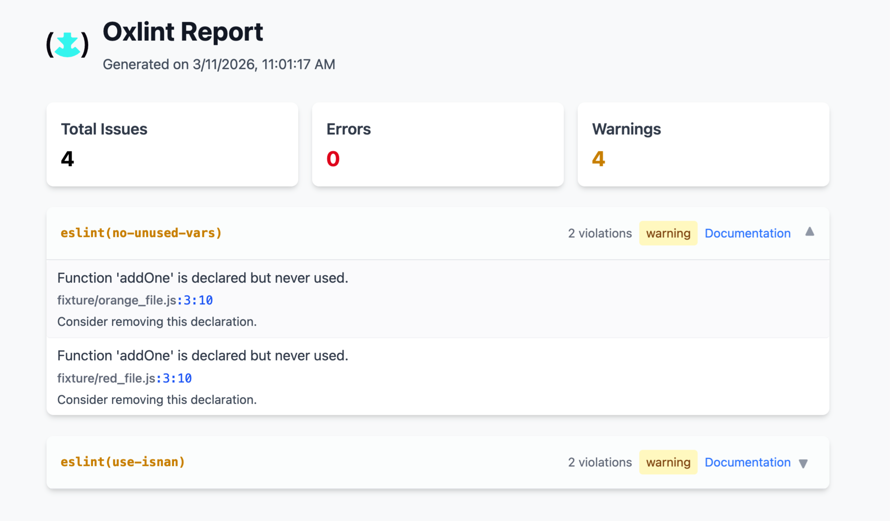

<p align="center">
  
</p>

<h1 align="center">oxlint-html-reporter</h1>

<p align="center">
  ✨ Generate beautiful HTML reports from <a href="https://oxc.rs/docs/guide/usage/linter.html">oxlint</a> output
</p>

<p align="center">
  
</p>

## 📦 Installation

```bash
npm install -g oxlint-html-reporter
# or
pnpm add -g oxlint-html-reporter
```

## 🚀 Usage

### Quick Start

Simply run in your project directory - it will automatically execute oxlint and generate a report:

```bash
npx oxlint-html
```

### From JSON File

```bash
# Generate from existing JSON file
npx oxlint-html oxlint-output.json

# Specify custom output file
npx oxlint-html oxlint-output.json my-report.html
```

### Pipe from oxlint

```bash
npx oxlint --format=json | oxlint-html
```

## 💻 Programmatic Usage

```javascript
import { generateReport } from 'oxlint-html-reporter';

await generateReport('input.json', 'output.html');
```

## ✅ Features

- 🎨 **Beautiful UI** - Modern design powered by Tailwind CSS
- 📊 **Summary Dashboard** - Quick overview of errors and warnings
- 📍 **Precise Locations** - File paths with line and column numbers
- 📚 **Rule Documentation** - Direct links to rule docs
- 📱 **Responsive Design** - Works on desktop and mobile
- ⚡ **Zero Runtime Dependencies** - Standalone HTML output

## 📄 License

MIT
